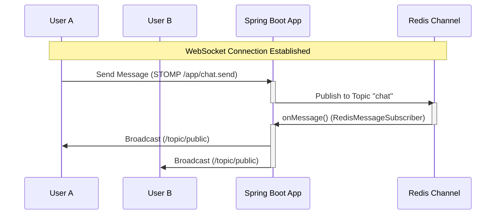

# Spring Boot Redis Chat Application

A real-time chat application built with Spring Boot, WebSockets (STOMP), and Redis Pub/Sub. This architecture enables scalable, real-time messaging by decoupling the chat state from the application server instance using Redis as a message broker.

## 🚀 Features

- **Real-time Messaging**: Instant message delivery using WebSockets.
- **Scalable Architecture**: Uses Redis Pub/Sub to broadcast messages across multiple application instances (if scaled).
- **User Join/Leave Notifications**: Automatically detects and broadcasts when users join or leave the chat.
- **JSON Serialization**: Messages are serialized to JSON for Redis storage and transport.

## 🛠️ Tech Stack

- **Java 17+**
- **Spring Boot 3.x** (Web, WebSocket, Data Redis)
- **Redis** (Message Broker)
- **Lombok**
- **SockJS & STOMP** (Client-side protocols)

## 🏗️ Architecture

The application uses a **Redis Pub/Sub** mechanism to handle messages. When a user sends a message via WebSocket, the controller publishes it to a Redis topic. A Redis listener subscribes to this topic and broadcasts the received message to all connected WebSocket clients via the internal message broker.

### Message Flow Diagram



## ⚙️ Prerequisites

Before running the application, ensure you have the following installed:

1.  **Java Development Kit (JDK) 17** or later.
2.  **Redis Server**: The application connects to Redis on `localhost:6379` by default.

## 🏃‍♂️ How to Run

### 1. Start Redis (Infrastructure)
Use Docker Compose to start the Redis container.
```bash
docker-compose up -d
```

### 2. Run the Application
You can run multiple instances to test the distributed chat functionality.

**Instance 1 (Port 8080):**
```bash
./mvnw spring-boot:run -Dspring-boot.run.profiles=instance1
```

**Instance 2 (Port 8081):**
```bash
./mvnw spring-boot:run -Dspring-boot.run.profiles=instance2
```

### 3. Access the Application
- **Instance 1**: Open `http://localhost:8080` in your browser.
- **Instance 2**: Open `http://localhost:8081` in a different browser or incognito window.

Connect both to the chat and send messages. You will see messages synced across both instances via Redis.

## 📂 Project Structure

- **`RedisConfig`**: Configures RedisTemplate and the Message Listener Container.
- **`WebsocketConfig`**: Configures STOMP endpoints and the Message Broker.
- **`ChatController`**: Handles incoming STOMP messages (`/chat.send`, `/chat.addUser`) and publishes them to Redis.
- **`RedisMessageSubscriber`**: Listens to the Redis topic and forwards messages to the WebSocket broker (`/topic/public`).
- **`WebsocketEventListener`**: Handles session disconnect events to notify users when someone leaves.

## 🔌 API Endpoints

### WebSocket Configuration
- **Endpoint**: `/chat-app` (with SockJS fallback)
- **Application Destination Prefix**: `/app`
- **Topic Prefix**: `/topic`

### STOMP Destinations
- **Send Message**: `/app/chat.send`
- **Add User**: `/app/chat.addUser`
- **Subscribe**: `/topic/public`

## 📝 Configuration

The application uses standard Spring Boot configuration. Key settings in `RedisConfig` and `ChatController` default to:

- **Redis Topic**: `chat` (configurable via `channel.topic` property)
